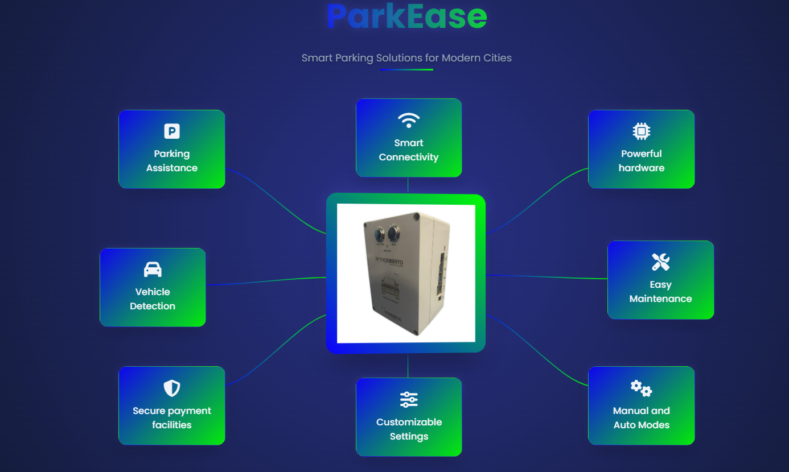

# ParkEase - Smart Parking Solution

**ParkEase** is a smart parking solution designed for modern cities. It offers a seamless parking experience with features like:
- Vehicle detection
- Parking assistance
- Secure payment facilities
- Smart connectivity
- Customizable settings

## Key Features
- **Parking Assistance**: Guides vehicles to available spaces.
- **Powerful Hardware**: Reliable performance in all conditions.
- **Secure Payments**: Ensures safe transactions for users.
- **Manual and Auto Modes**: Flexibility for diverse parking needs.
- **Smart Connectivity**: Wi-Fi-enabled for remote management.
- **Easy Maintenance**: Designed for durability and ease of use.

## Preview
Here's a snapshot of the interface:



## Installation
1. Clone the repository:
   ```bash
   git clone https://github.com/yourusername/parkease.git
